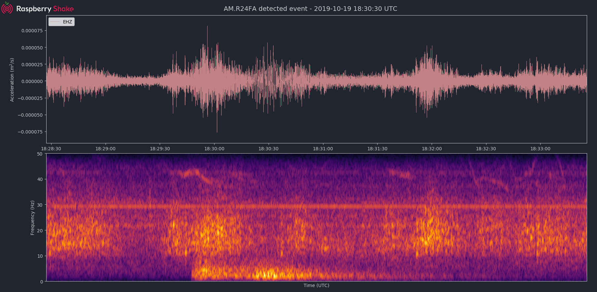

# rsudp

### Tools for receiving and interacting with Raspberry Shake UDP data
*Written by Ian Nesbitt (@iannesbitt) and Richard Boaz (@ivor)*

`rsudp` is a tool for receiving and interacting with UDP data sent from a Raspberry Shake seismograph. It contains six main features:
1. Print - a debugging tool to output raw UDP output to the command line
2. Writer - a miniSEED writer
3. Plot - a live-plotting routine to display data as it arrives on the port, with an option to save plots some time after an `ALARM` message is read from the queue
4. Forward - forward a data cast to another destination
5. Alarm - an earthquake/sudden motion alert---complete with bandpass filter capability---configured to send an `ALARM` message to the queue in the event of a recursive STA/LTA alarm trigger, and optionally run some code
6. AlertSound - a thread that plays a MP3 audio file when an `ALARM` message is read from the queue

`rsudp` is written in Python but requires no coding knowledge to run. Simply follow the instructions to install the software, go to your Shake's web front end, point a UDP data cast at your computer's local IP address, start rsudp from the command line, and watch as the data rolls in.

## Notes about `rsudp`

**Note: The port you send data to must be open on the receiving end.** In Windows, this may mean clicking "allow" on a firewall popup. On most other machines, the port you send UDP data to (8888 or 18001 are common choices) must be open to UDP traffic.

Generally, if you are sending data inside a local network, there will not be any router firewall to pass data through. If you are sending data to another network, you will almost certainly have to forward data through a firewall in order to receive it. Raspberry Shake cannot help you figure out how to set up your router to do this. Contact your ISP or network administrator, or consult your router's manual for help setting up port forwarding.

**Note: this program has not been tested to run on the Raspberry Shake itself.** Raspberry Shake is not liable to provide support for any strange Shake behavior should you choose to do this. This program is intended to run on a separate RPi or workstation, and for the Raspberry Shake to cast data to that computer.


## Installation

### On Linux & MacOS

A UNIX installer script is available at `unix-install-rsudp.sh`. This script checks whether or not you have Anaconda installed, then downloads and installs it if need be. This script has been tested on both `x86_64` and `armv7l` architectures (meaning that it can run on your home computer or a Raspberry Pi) and will download the appropriate Anaconda distribution, set up a virtual Python environment, and leave you ready to run the program. To install using this method:

```bash
$ bash unix-install-rsudp.sh
```

**Note: the installer script will pause partway through to ask if you would like to make the `conda` command executable by default. This is done by appending the line below to your `~/.bashrc` file.** This is generally harmless, but if you have a specific objection to it, hitting any key other than "y" will cause the script to skip this step. You will have to manually run the `conda` executable in this case, however. If you choose to do it manually later, the line appended to the end of `~/.bashrc` is the following (architecture-dependent):

On x86 systems:
```bash
. $HOME/miniconda3/etc/profile.d/conda.sh
```
or on ARMv7 architecture with Raspbian OS:
```bash
. $HOME/berryconda3/etc/profile.d/conda.sh
```
*Note: You can run `uname -m` to check your computer's architecture.*

where `$HOME` is the home directory of the current user.

#### Updating

Unix users can update the repository to the latest development version by running the following commands:

```bash
cd /rsudp/location
git pull
bash unix-update-rsudp.sh
```

### On Windows

1. Download and install [Anaconda](https://www.anaconda.com/distribution/#windows) or [Miniconda](https://docs.conda.io/en/latest/miniconda.html).
2. Open an Anaconda Prompt.
3. Execute the following lines of code:

```bash
conda config --append channels conda-forge
conda create -n rsudp python=3 matplotlib=3.1.1 numpy=1.16.4 future scipy lxml sqlalchemy obspy
conda activate rsudp
pip install rsudp
```
## Using this software

1. First, to activate the conda environment, type `conda activate rsudp`.

2. Next, you will need a data cast (formerly known as a UDP stream) pointed at an open port on the computer you plan to run this on. By default this port is 8888.

3. The UNIX installer will create a settings file in `$HOME/.config/rsudp/rsudp_settings.json`. (Windows users will need to type `rsudp -d default` to dump the settings to a file the first time they run this program.) Change the settings in this file to control how the client operates.

  To dump the default settings to a different location of your choosing, type `rs-client -d rsudp_settings.json`. (As stated above, to rebuild and overwrite the default settings file in `$HOME/.config/rsudp/rsudp_settings.json`, type `rs-client -d default`)

4. After modifying the settings file to your liking, type `rs-client` to use the settings file at `$HOME/.config/rsudp/rsudp_settings.json`, or `rs-client -s rsudp_settings.json` to run with a different settings file.

**Note:** This library can only handle incoming data from one Shake per port. If for some reason more than one Shake is sending data to the port, the software will only process data coming from the IP of the first Shake it sees sending data.

## Settings

By default, the settings are as follows:

```json
{
"settings": {
    "port": 8888,
    "station": "Z0000",
    "output_dir": "@@DIR@@",
    "debug": true},
"printdata": {
    "enabled": false},
"write": {
    "enabled": false,
    "channels": "all"},
"plot": {
    "enabled": true,
    "duration": 30,
    "spectrogram": true,
    "fullscreen": false,
    "kiosk": false,
    "eq_screenshots": false,
    "channels": ["HZ", "HDF"],
    "deconvolve": false,
    "units": "CHAN"},
"forward": {
    "enabled": false,
    "address": "192.168.1.254",
    "port": 8888,
    "channels": ["all"]},
"alert": {
    "enabled": true,
    "highpass": 0,
    "lowpass": 50,
    "deconvolve": false,
    "units": "VEL",
    "sta": 6,
    "lta": 30,
    "threshold": 1.7,
    "reset": 1.6,
    "exec": "eqAlert",
    "channel": "HZ",
    "win_override": false},
"alertsound": {
    "enabled": false,
    "mp3file": "doorbell"}
}
```

## Modules

- The **`settings`** portion of the settings file contains some basic items: `"port"`, `"station"`, `"output_dir"`, and `"debug"`. Change `"port"` if you are receiving the data at a different port than `8888`. If you would like to set your station name, change `"station"`. `"output_dir"` will contain folders for miniSEED data and plot screenshots, which are explained in the relevant sections (**`write`** and **`plot`**) below. The directory specified here will be created if it doesn't already exist. `"debug"` controls how much text is sent to the command line STDOUT (even if this is `false`, output will always be sent to a log at `/tmp/rsudp/rsudp.log`).

- **`printdata`** controls the data output module, which simply prints Shake data packets to stdout as it receives them. Change `"enabled"` to `true` to activate.

- **`write`** controls a very simple STEIM2 miniSEED writer. If `"enabled"` is `true`, seismic data is appended to a miniSEED file with a descriptive name in the `data` directory inside of `"output_dir"` every 10 seconds. By default, `"all"` channels will be written to their own files. You can change which channels are written by changing this to, for example, `["EHZ", "ENZ"]`, which will write the vertical geophone and accelerometer channels from RS4D output.

- **`plot`** controls the thread containing the GUI plotting algorithm. This module can plot seismogram data from a list of 1-4 Shake channels, and calculate and display a spectrogram alongside each. By default the `"duration"` in seconds is `30`. The plot will refresh at most once per second, but slower processors may take longer. The longer the duration, the more processor power it will take to refresh the plot, especially when the spectrogram is enabled. To disable the spectrogram, set `"spectrogram"` to `false` in the settings file. To put the plot into fullscreen window mode, set `"fullscreen"` to `true`. To put the plot into kiosk mode, set `"kiosk"` to `true` (NB: kiosk mode will cause the plot will fill the entire screen and you will only be able to exit it by pressing Ctrl+W or pressing Alt+Tab (Command+Tab on Mac OS) to bring up a window switcher), On a Raspberry Pi 3B+ plotting 600 seconds' worth of data and a spectrogram from one channel, the update frequency is approximately once every 5 seconds, but more powerful processors will allow a higher refresh speed. Because the `plot` module is queue based, it should not drop any packets, no matter the processor. Dropped packets (if you experience them) are most likely a sign of network issues.

  By default, the `"channels"` field is `["HZ", "HDF"]`. This will resolve to at least one channel of any Shake input. "HZ" will match either "SHZ" or "EHZ" depending on your Shake digitizer model, and "HDF" will match the pressure transducer channel on a Raspberry Boom or Shake & Boom. If one of the channels in the list doesn't exist in the data sent to the port, it will be ignored.

  The program will use the Raspberry Shake FDSN service to search for an inventory response file for the Shake you specify in the `"station"` field. If it successfully finds an inventory, setting `"deconvolve"` to `true` will deconvolve the channels plotted to either `"ACC"` (acceleration in m/s^2), `"VEL"` (velocity in m/s), or `"DISP"` (displacement in m). The default is `"CHAN"` which lets the program deconvolve the channel to its native units (acceleration for accelerometers, and velocity for geophones). This means that the Shake must both have the 4.5 Hz geophone distributed by RS, and be forwarding data to the Shake server, in order to properly calculate deconvolution. The Raspberry Boom will always display in Voltage counts, which is not a deconvolved unit.

  If the alert module is enabled, setting `"eq_screenshots"` to `true` will result in screenshots being saved whenever there is an `ALARM` packet sent to the queue (see **alert** section below). The script will save one PNG figure per alert to the `screenshots` directory inside of `"output_dir"` when the leading edge of the quake is about 60% of the way across the plot window. This will only occur when the alarm gets triggered, however, so make sure to test your alert settings thoroughly.

- **`forward`** controls a UDP data cast forwarding module. You can forward a list of channels from a data cast to the `"address"` and `"port"` specified, just like you would from the Shake's web front end. By default, `["all"]` channels are forwarded.

- **`alert`** controls the alert module (please see [Disclaimer](#disclaimer) below). The alert module is a fast recursive STA/LTA sudden motion detector that utilizes obspy's [`recursive_sta_lta()`](https://docs.obspy.org/tutorial/code_snippets/trigger_tutorial.html#recursive-sta-lta) function. STA/LTA algorithms calculate a ratio of the short term average of station noise to the long term average. The data can be highpass, lowpass, or bandpass filtered by changing the `"highpass"` and `"lowpass"` parameters from their defaults (0 and 50 respectively). By default, the alert will be calculated on raw count data from the vertical geophone channel (either `"SHZ"` or `"EHZ"`). It will throw an error if there is no Z channel available (i.e. if you have a Raspberry Boom with no geophone). If you have a Boom and still would like to run this module, change the default channel `"HZ"` to `"HDF"`.

  Like in the plot module, the alert module will deconvolve the instrument response if a response file exists for your `"station"` on the Raspberry Shake FDSN server. Same as above, if the response file exists, setting `"deconvolve"` to `true` will cause the alert function to calculate the STA/LTA ratio on deconvolved data (again `"ACC"`, `"VEL"`, or `"DISP"`).

  If the STA/LTA ratio goes above a certain value (defined by `"threshold"`), then the module will cause the Producer loop to out an `ALARM` packet on the queue, which will be distributed to every consumer module. In addition to sending `ALARM` packets, `alert` can also run a function passed to it (see the explanation of `exec()` in the paragraph below). By default, this function is `rsudp.client.eqAlert()` which just outputs some text to the logger. To play a sound, see the `alarmsound` module. When the ratio goes back below the `"reset"` value, the alarm is reset.

  You can change the `"exec"` field and supply a path to executable Python code to run with the `exec()` function. Be very careful when using the `exec()` function, as it is known to have problems. Notably, it does not check the passed code for errors prior to running. Additionally, if the code takes too long to execute, you could end up losing data packets, so keep it simple (sending a message or a tweet, which should either succeed or time out in a few seconds, is really the intended purpose). In testing, we were able to run scripts with execution times of 30 seconds without losing any data packets. Theoretically you could run code that takes longer to process than that, but the issue is that the longer it takes the function to process code, the longer the module will go without processing data from the queue (the queue can hold up to 2048 packets, which for a RS4D works out to 128 seconds' worth of data). Another way of saying this is: you will miss whatever subsequent earthquakes occur while `exec()` is running. A much better way to run your own code would be to fork this repository and create a new thread that sits idle until it sees an `ALARM` data packet on the queue. That way, the `alert` module can process more queue packets simultaneously to the execution of alarm-state code.

  If you are running Windows and have code you want to pass to the `exec()` feature, Python requires that your newline characters are in the UNIX style (`\n`), not the standard Windows style (`\r\n`). To convert, follow the instructions in one of the answers to this [stackoverflow question](https://stackoverflow.com/questions/17579553/windows-command-to-convert-unix-line-endings). If you're not sure what this means, please read about newline/line ending characters [here](https://en.wikipedia.org/wiki/Newline). If you are certain that your code file has no Windows newlines, you can set `"win_override"` to `true`.

- **`alarmsound`** if `"enabled"` is `true` and you have either `ffmpeg` or `libav` installed, this module plays an MP3 sound every time it receives an `ALARM` queue message. For details on installation of these dependencies, see [this page](https://github.com/jiaaro/pydub#dependencies)).

  The software will install several small MP3 files. The `"mp3file"` is `"doorbell"` (two doorbell chimes) by default, but there are a few more aggressive alert sounds, including: a three-beep sound `"beeps"`, a sequence of sonar pings `"sonar"`, and a continuous alarm beeping for 5 seconds, `"alarm"`. You can also point the `"mp3file"` field to an MP3 file somewhere in your filesystem. For example, if your username was pi and you had a file called earthquake.mp3 in your Downloads folder, you would specify `"mp3file": "/home/pi/Downloads/earthquake.mp3"`. The program will throw an error if it can't find (or load) the specified MP3 file. It will also alert you if the software dependencies for playback are not installed.

## Disclaimer

**NOTE: It is extremely important that you do not rely on this code to save life or property.** Raspberry Shake is not liable for earthquake detection false positives, false negatives, errors running the Alert module, or any other part of this library; it is meant for hobby and non-professional notification use only. If you need professional software meant to provide warning that saves life or property please contact Raspberry Shake directly or look elsewhere. See sections 16 and 16b of the [License](LICENSE).

## pydub dependencies

If you would like to play sounds when the STA/LTA trigger activates, you will need to take the following steps:

1. [Install the release version of this software](#installation) if you have not already.
2. [Install the dependencies for `pydub`](https://github.com/jiaaro/pydub#dependencies) which are available cross-platform using most package managers. (Linux users can simply type `sudo apt install ffmpeg`, and MacOS users with Homebrew can type `brew install ffmpeg`) but Windows users will have to follow more detailed instructions.
3. Change `"alertsound"` from `false` to `true` in the settings file. (`~/.config/rsudp/rsudp_settings.json` on Mac and Linux, `C:\Program Files\RSHAKE\rsudp\rsudp_settings.json` on Windows)
4. Start the rsudp client by typing `rs-client` or by pointing it at an existing settings file `rs-client -s /path/to/settings.json`
5. Wait for the trigger to warm up, then stomp, jump, or Shake to hear the sound!

## Plot + Alarm example


This plot of a M 4.2 earthquake 80 km away was saved automatically without user intervention. Tired of searching through old data to find earthquakes? With a properly tuned alarm threshold and the `eq_screenshots` setting, rsudp can save images of alarm events for you to view and share later. The plot above was created with the following settings:

```json
{
"settings": {
    "port": 8888,
    "station": "R24FA",
    "output_dir": "/home/pi/rsudp",
    "debug": true},
"printdata": {
    "enabled": false},
"write": {
    "enabled": false,
    "channels": "all"},
"plot": {
    "enabled": true,
    "duration": 300,
    "spectrogram": true,
    "fullscreen": true,
    "kiosk": false,
    "eq_screenshots": true,
    "channels": ["HZ", "HDF"],
    "deconvolve": true,
    "units": "ACC"},
"forward": {
    "enabled": false,
    "address": "127.0.0.1",
    "port": 13000,
    "channels": ["EHZ"]},
"alert": {
    "enabled": true,
    "highpass": 0,
    "lowpass": 8,
    "deconvolve": false,
    "units": "ACC",
    "sta": 6,
    "lta": 30,
    "threshold": 1.581,
    "reset": 1.574,
    "exec": "eqAlert",
    "channel": "HZ",
    "win_override": false},
"alertsound": {
    "enabled": true,
    "mp3file": "doorbell"}
}
```

One note to consider here is that the `"reset"` setting is nearly as important to earthquake detection as `"threshold"`. If `"reset"` is set too high, for example, you may end up with two trigger events: one for the P-wave and one for the S-wave. The taper on the trailing side of a big quake typically results in STA/LTA ratios well below 1, but setting it too low may result in the trigger not shutting off properly. Because each seismograph installation site is different, and no two earthquakes are exactly the same, there is no "right answer" for what to set these parameters to. Experimentation with the parameters is key!

# Contributing

Contributions to this project are more than welcome. If you find ways to improve the efficiency of the library or the modules that use it, or come up with cool new modules to share with the community, we are eager to include them (provided, of course, that they are stable and achieve a clearly stated goal).

Since the Producer function passes an `ALARM` queue message when it sees `Alert.alarm=True`, other modules can be easily added and programmed to do something when they see this message. This is to help make the addition of other action-based modules straightforward.

Some ideas for improvements are:
- a module that creates a twitter post when it reads the "ALARM" queue message
- a way to plot trigger-on and trigger-off events using osbpy's [trigger_onset](https://docs.obspy.org/packages/autogen/obspy.signal.trigger.trigger_onset.html) ([example here](https://docs.obspy.org/tutorial/code_snippets/trigger_tutorial.html#advanced-example))
- GPIO pin interactions (lights, motor control, buzzers, etc.)
- a more efficient plotting routine
- a way to optionally run the plot module with the `Agg` backend in matplotlib, which would allow the creation of screenshots without the need for a plot window to appear
- Windows batch scripts similar to the provided UNIX ones
- a way to plot in which Tk and Qt don't throw warnings and errors about plotting in a secondary thread. Plotting in another thread is technically bending the rules of Matplotlib backends. We are using tools that were not built for the job, but as it turns out there are very few Python tools suitable for this particular job...

## Bugs

This software, like most, contains bugs and errors. If you find a bug, please create a GitHub issue. Be sure to describe the problem clearly, attach your logs (`/tmp/rsudp/rsudp.log`) and/or copy/paste command line output in triple backticks \`\`\` like this \`\`\` to format it as code.
