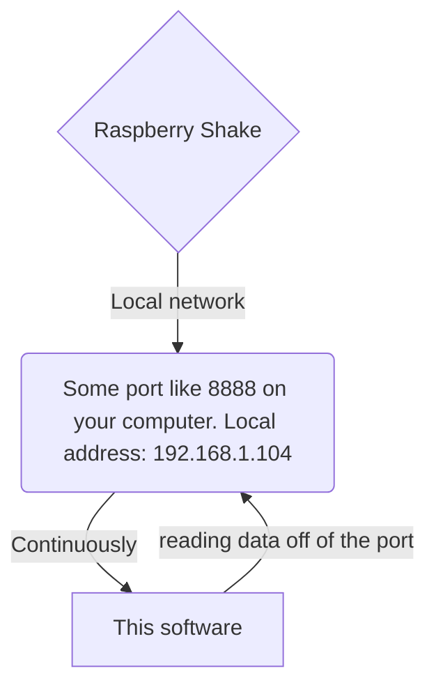
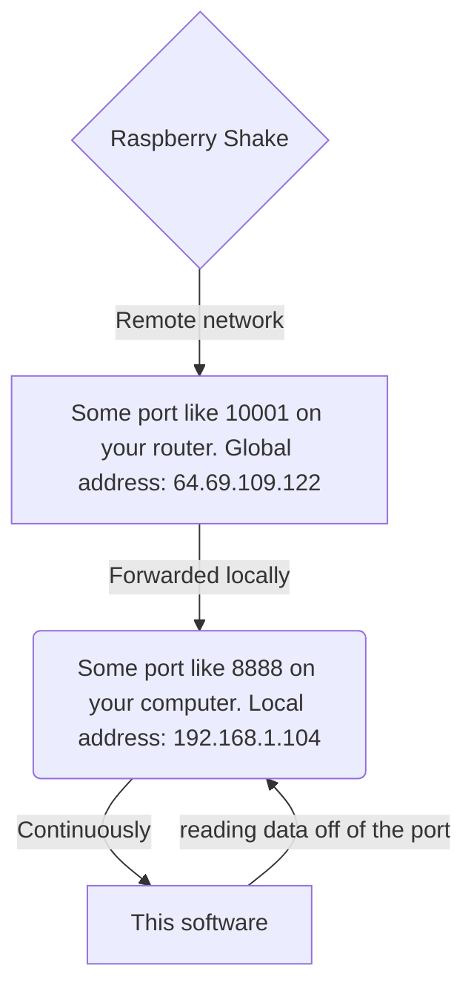

# rsh-UDP


### Tools for receiving and interacting with Raspberry Shake UDP data
*Written by Richard Boaz (@ivor) and Ian Nesbitt (@iannesbitt) for @osop*  
*This file is easiest to read at https://gitlab.com/osop-raspberry-shake/rsh-UDP/blob/master/README.md*

### Contents of this readme:

0) [How to use these tools](#how-to-use-these-tools)
   - An explanation of how UDP data works and what this software's function is

#### Python libraries

1) [`raspberryShake.py`](#raspberryshakepy)
   - Library of shake-related functions, to be used in a parent python program wanting to process data off a UDP port

2) [`rs2obspy.py`](#rs2obspypy)
   - Example library that uses raspberryShake.py to process UDP data to obspy stream object with channel-specific traces. Can be iterated.

#### Command line programs

3) [`shake-UDP-packetLoss.py`](#shake-udp-packetlosspy)
   - Program that will report UDP data packet loss between a shake and a receiving computer 
    to be run on receiving computer

4) [`shake-UDP-local.py`](#shake-udp-localpy)
   - Program to read data off UDP port, to be run from Shake command line directly

5) [`shake-UDP-remote.py`](#shake-udp-remotepy)
   - Program to read data off UDP port, to be run from a command line on the receiving computer, not the shake

6) [`obspy_example.py`](#obspy_examplepy)
   - Command line program to read UDP data to an ObsPy stream continuously, then plot it when the user presses CTRL+C

7) [`live_example.py`](#live_examplepy)
   - Reads UDP data and continuously updates a waveform and spectrogram plot, to be used from the command line

#### Resources

8) [Get help](#get-help)
   - Help resources, community support, and paid technical support

## How to use these tools
([back to top](#contents-of-this-readme))

Before you do anything, you should read the [manual page on UDP](https://manual.raspberryshake.org/udp.html#udp). This will tell you how to forward UDP data from your shake to a port on your local computer. That page is available at https://manual.raspberryshake.org/udp.html#udp.

The standard way to utilize the Raspberry Shake's UDP capability is by forwarding the UDP stream to a computer on the same local network (see [local example diagram](#local-example-diagram) below).

If the Shake and the computer you're working on *aren't* on the same network, usually you have to aim the UDP stream at the external IP of the router on your side, then fiddle with the port forwarding settings on the router to forward the data to a port at your device's local, internal IP address (see [remote example diagram](#remote-example-diagram) below).

### Local example diagram

Here's a visual diagram demonstrating a local connection. Home routers typically don't block any internal traffic, so while the router is implied here, it doesn't need to be configured in any way, so it's left out of the diagram.


### Remote example diagram

And here's a diagram demonstrating a truly remote connection. In this case UDP data is being sent from a distant network to a port (10002) on the externally-facing IP of your router (in this example your router's global IP address is 64.69.109.122), and your router is forwarding that to port 8888 your computer (for example 192.168.1.104). This can be done with any modern router, but unfortunately since there are so many routers out there, you'll have to figure out how to do this with your specific make and model yourself.



So before you work with this software, please read the [manual](https://manual.raspberryshake.org/udp.html#udp) to ensure that you are forwarding data to the correct place and it's not getting stuck in a router firewall somewhere.

# Python libraries

## raspberryShake.py
([back to top](#contents-of-this-readme))

This is the heart of the library. Use this to open a port, get data packets, and interpret those packets to readable, but still pretty basic python data types.

### Initializing a connection on a port

Basic usage must start by initializing the library with the `initRSlib()` and `openSOCK()` functions. Specify the data port to listen on and the station name using the arguments `dport=<integer>` and `rssta=<string>` respectively. *Keep in mind that once you open a port, you will not be able to open the same port elsewhere until you quit the program using the port.*

```python
>>> import raspberryShake as rs
>>> rs.initRSlib(dport=8888, rssta='R0E05')
>>> rs.openSOCK()
2019-01-14 15:23:29 Opening socket on (HOST:PORT) localhost:8888
>>>
```

### Reading data packets

Then, you can read data packets off of the port and interpret their contents.

```python
>>> packet = rs.getDATA()
>>> packet
"{'EHZ', 1547497409.05, 610, 614, 620, 624, 605, 646, 648, 693, 639, 669, 654, 645, 690, 656, 687, 667, 703, 650, 641, 634, 637, 706, 641, 671, 617}"
>>> rs.getCHN(packet)
'EHZ'
>>> rs.getTIME(packet)          # seconds since 1/1/1970 UTC; more on this below
1547497409.05
>>>
```

Time is represented in what's called a UNIX timestamp. This is the number of seconds since 00:00:00 on January 1, 1970, in UTC. Seismic libraries like [ObsPy](https://www.obspy.org/) will be able to interpret this number to date and time without you doing anything to modify it. Python's datetime library lets you do something similar.

```python
>>> from datetime import datetime
>>> timestamp = rs.getTIME(packet)
>>> dt = datetime.utcfromtimestamp(timestamp)
>>> dt
datetime.datetime(2019, 1, 14, 20, 23, 29, 50000)
>>> print(dt)
2019-01-14 20:23:29.050000
>>>
```

### Data stream

Now let's look at the data stream and some of its attributes.

```python
>>> rs.getSTREAM(packet)
[610, 614, 620, 624, 605, 646, 648, 693, 639, 669, 654, 645, 690, 656, 687, 667, 703, 650, 641, 634, 637, 706, 641, 671, 617]
>>>
```

The data stream is a list object with values representing raw voltage counts from the geophone. They're measured at whatever millisecond frequency your device measures at. For older models, this means 50 Hz (one sample every 20 ms), and for newer ones that's 100 Hz (one sample every 10 ms). Luckily, we've written a way to tell the sampling frequency mathematically.

```python
>>> tr = rs.getTR('EHZ')        # elapsed time between packet transmissions, in milliseconds
>>> tr
250
>>> rs.getSR(tr, packet)        # the sampling rate in hertz
100
>>>
```

*Note the difference in units: elapsed milliseconds vs hertz.*

So the first sample occurs at `1547497409.05` and each subsequent sample is 10 ms (1000 ms / 100 Hz) later. It turns out that this is all we need to convert this raw data stream to, say, an ObsPy data trace.

## rs2obspy.py
([back to top](#contents-of-this-readme))

`rs2obspy` is a way to get more complex and useful functionality from UDP data, by interpreting your Shake's UDP data and translating it to ObsPy data stream format. This library uses the `raspberryShake` library to initialize a port, get data on that port, then construct obspy traces and append them to an [ObsPy](https://www.obspy.org/) stream object. As such this library requires `obspy`. See [obspy example](#obspy_examplepy) and [live_example.py](#live_examplepy) for working usage examples for this library. See below for a walkthrough.

### Initialize the library with a port and a station name

The basic functionality of the `rs2obspy` library is pretty simple. You initialize the library in almost the same way as the `raspberryShake` library, but you supply the port with `port=<integer>` and station name with `sta=<string>`. Once you open a port, you will not be able to open the same port elsewhere until you exit the program. The following is an example with an RS3D.

```python
>>> import rs2obspy as rso
>>> rso.init(port=8888, sta='R4989')
2019-01-14 17:29:31 Opening socket on (HOST:PORT) localhost:8888
2019-01-14 17:29:31 Got data with sampling rate 100 Hz (calculated from channel EHZ)
2019-01-14 17:29:32 Found 3 channel(s): EHE EHN EHZ 
2019-01-14 17:29:32 Fetching inventory for station AM.R4989 from Raspberry Shake FDSN.
2019-01-14 17:29:32 Inventory fetch successful.
>>>
```

If you specify a station name, the inventory fetch will happen automatically by pinging the Raspberry Shake Community Server's FDSN service and downloading a StationXML inventory file. This is useful if, in a more complex use case, you want to deconvolve the instrument response to calculate ground motion.

### Initialize a stream

Now you'll call the `init_stream()` function, which will return an obspy stream object with one trace inside (it will have processed one data packet). If the program was able to download an inventory file, that inventory will be attached to the stream.

```python
>>> s = rso.init_stream()
2019-01-14 17:32:02 Initializing Stream object.
2019-01-14 17:32:02 Attaching inventory response.
>>> s
<obspy.core.stream.Stream object at 0x7f4b03496dd0>
>>> print(s)
1 Trace(s) in Stream:
AM.R4989.00.EHE | 2019-01-14T22:29:31.750000Z - 2019-01-14T22:29:31.990000Z | 100.0 Hz, 25 samples
>>> 
```

### Update your stream

From here, you'll just need to update the stream for every data packet you receive using `update_stream(<stream object>)`. You'll need to feed it an already-initialized stream to update, like the example below. This is easiest with a loop, in which case the function will wait for data and automatically update when it receives something.

```python
>>> s = rso.update_stream(s)
>>> s = rso.update_stream(s)
>>> print(s)
3 Trace(s) in Stream:
AM.R4989.00.EHZ | 2019-01-14T22:29:32.000000Z - 2019-01-14T22:29:32.240000Z | 100.0 Hz, 25 samples
AM.R4989.00.EHE | 2019-01-14T22:29:31.750000Z - 2019-01-14T22:29:31.990000Z | 100.0 Hz, 25 samples
AM.R4989.00.EHN | 2019-01-14T22:29:31.750000Z - 2019-01-14T22:29:31.990000Z | 100.0 Hz, 25 samples
>>>
```

Continuing to update the stream `s` using the `update_stream(s)` call will keep adding traces (one per data packet) to the stream, then merging them based on the channel. So you'll end up with a continuous stream with as many traces as there are channels on your Shake. And you'll have the full functionality of `obspy` at your fingertips.

# Command line programs

## shake-UDP-packetloss.py
([back to top](#contents-of-this-readme))

Track lost packets at specified intervals from the command line.

### Usage

`python shake-UDP-packetloss.py -p <port> -f <report frequency>`

`-p <integer>`  - Port. Whole, positive number referring to the port to listen for data on.  
`-f <integer>`  - Report frequency. Whole, positive number of seconds to wait before reporting on packetloss statistics. Lost packets will always be reported as they happen as well. Default is 60.

This program is meant to run from the command line and is pretty simple to use. It only takes two inputs, port and report frequency in seconds.

The following example shows a two hour run with a report frequency of 3600 seconds (1 hour) for an RS4D sending data to port 18001.

```
$ python shake-UDP-packetloss.py -p 18001 -f 3600
2019-01-07 16:01:00 Initializing...
2019-01-07 16:01:00 Opening socket on (HOST:PORT) localhost:18001
2019-01-07 16:01:00 Opened data port successfully.
2019-01-07 16:01:01 	Total Channels: 4
2019-01-07 16:01:01 	   Sample Rate: 100 samples / second
2019-01-07 16:01:01 	       TX Rate: Every 250 milliseconds
2019-01-07 16:01:01 Data Packet reading begun.
2019-01-07 16:01:01 Will report any DP loss as it happens and totals every 3600 seconds.
2019-01-07 17:00:00 CHANNEL EHZ: total packets lost in last 3538 seconds: 0 ( 0.0% / 14152.0 )
2019-01-07 17:00:00 CHANNEL ENN: total packets lost in last 3538 seconds: 0 ( 0.0% / 14152.0 )
2019-01-07 17:00:00 CHANNEL ENZ: total packets lost in last 3538 seconds: 0 ( 0.0% / 14152.0 )
2019-01-07 17:00:00 CHANNEL ENE: total packets lost in last 3539 seconds: 0 ( 0.0% / 14156.0 )
2019-01-07 17:19:32 DP loss of 0.5 second(s) Current TS: 1546895972.09, Previous TS: 1546895971.59
2019-01-07 17:34:33 DP loss of 0.5 second(s) Current TS: 1546896872.83, Previous TS: 1546896872.33
2019-01-07 18:00:00 CHANNEL EHZ: total packets lost in last 3600 seconds: 0 ( 0.0% / 14400.0 )
2019-01-07 18:00:00 CHANNEL ENN: total packets lost in last 3600 seconds: 2 ( 0.01% / 14400.0 )
2019-01-07 18:00:00 CHANNEL ENZ: total packets lost in last 3600 seconds: 0 ( 0.0% / 14400.0 )
2019-01-07 18:00:00 CHANNEL ENE: total packets lost in last 3600 seconds: 2 ( 0.01% / 14400.0 )
^C
2019-01-07 18:02:37 Quitting...
$ 
```

As with most command line programs, the CTRL+C keystroke will end the program and return to the shell.

## shake-UDP-local.py
([back to top](#contents-of-this-readme))

This program is meant to run from the Shake itself, to make sure that UDP data is flowing at least to its own internal port (8888 by default).

### Usage

`python shake-UDP-local.py`

From the Shake's command line:

```
myshake@raspberryshake:/opt/settings/user $ python shake-UDP-local.py 
2019-01-15 20:20:49 Opening socket on (HOST:PORT) localhost:8888
{'EHZ', 1547583648.980, 544, 527, 490, 550, 625, 637, 545, 429, 436, 540, 620, 578, 559, 500, 458, 513, 574, 598, 511, 454, 481, 550, 567, 530, 477}
{'EHE', 1547583648.980, 415, 435, 431, 454, 472, 483, 478, 447, 443, 458, 492, 535, 546, 507, 452, 442, 438, 444, 453, 458, 482, 514, 529, 544, 557}
{'EHN', 1547583648.980, -173, -209, -253, -219, -220, -215, -156, -108, -90, -97, -206, -243, -215, -259, -236, -194, -179, -199, -222, -241, -200, -160, -192, -157, -148}
{'EHZ', 1547583649.230, 473, 550, 588, 620, 605, 532, 513, 572, 611, 597, 561, 535, 592, 659, 682, 602, 499, 505, 612, 679, 649, 589, 498, 511, 555}
{'EHE', 1547583649.230, 542, 550, 552, 542, 497, 449, 467, 514, 561, 581, 541, 503, 506, 478, 502, 552, 514, 503, 500, 484, 483, 456, 471, 487, 492}
{'EHN', 1547583649.230, -154, -178, -212, -257, -288, -252, -244, -232, -269, -240, -186, -192, -156, -191, -241, -262, -273, -238, -206, -228, -244, -250, -268, -241, -208}
^C
2019-01-15 20:20:49 Quitting...
myshake@raspberryshake:/opt/settings/user $ 
```

Use CTRL+C to quit the program and return to the shell.


## shake-UDP-remote.py
([back to top](#contents-of-this-readme))

This program is meant to run from the computer receiving Shake UDP data, to make sure that data is flowing.

### Usage

`python shake-UDP-remote.py -p <port>`

`-p <integer>`  - Port. Whole, positive number referring to the port to listen for data on.  

```
$ python shake-UDP-remote.py -p 18003
2019-01-15 15:30:56 Opening socket on (HOST:PORT) localhost:18003
"{'EHZ', 1547584256.480, 686, 545, 550, 581, 611, 650, 561, 483, 485, 543, 883, 595, 151, 700, 684, 449, 447, 654, 563, 335, 702, 598, 345, 473, 603}"
"{'EHE', 1547584256.480, 295, 285, 330, 418, 429, 395, 346, 313, 369, 418, 421, 203, 182, 404, 439, 328, 305, 419, 360, 334, 405, 398, 231, 193, 483}"
"{'EHN', 1547584256.480, -218, -184, -127, -189, -229, -174, -216, -211, -215, -294, -275, -155, -43, -260, -206, -58, -286, -230, -290, -243, -160, -117, 13, -217, -262}"
"{'EHZ', 1547584256.730, 621, 581, 519, 611, 496, 392, 605, 766, 548, 484, 697, 594, 500, 666, 736, 518, 500, 628, 718, 630, 374, 510, 657, 624, 685}"
"{'EHE', 1547584256.730, 619, 460, 249, 136, 301, 549, 555, 410, 253, 293, 453, 411, 353, 457, 506, 508, 486, 350, 271, 293, 430, 586, 523, 438, 408}"
"{'EHN', 1547584256.730, -332, -287, -179, -108, -103, -157, -113, -263, -148, -205, -286, -151, -130, -171, -231, -252, -275, -195, -154, -142, -133, -173, -179, -133, -155}"
^C
2019-01-15 15:30:57 Quitting...
$ 
```

Use CTRL+C to quit the program and return to the shell.


## obspy_example.py
([back to top](#contents-of-this-readme))

`python live_example.py -p <port> -s <station> [-h]`

`-p <integer>`  - Port. Whole, positive number referring to the port to listen for data on.  
`-s <string>`   - Station name. Usually 5 characters, usually something like R4989 or SF4A5.  
`-h` - (optional) Display help text.  

This program is also meant to run from the command line of a computer receiving Shake data. It's a fairly simple use case for working with ObsPy data. It is designed to simply run and gather data into an ObsPy stream for a length of time until the user presses CTRL+C, at which time it will plot the data using Matplotlib.

Although this is a simple program, it does requires ObsPy, Numpy, and Matplotlib, which we recommend installing via Anaconda.

### Usage

Here's an example of its use:

```
$ python obspy_example.py -p 18003 -s R4989
2019-01-15 16:04:27 Opening socket on (HOST:PORT) localhost:18003
2019-01-15 16:04:28 Got data with sampling rate 100 Hz (calculated from channel EHZ)
2019-01-15 16:04:28 Found 3 channel(s): EHE EHN EHZ 
2019-01-15 16:04:28 Fetching inventory for station AM.R4989 from Raspberry Shake FDSN.
2019-01-15 16:04:29 Inventory fetch successful.
2019-01-15 16:04:29 Initializing Stream object.
2019-01-15 16:04:29 Attaching inventory response.
2019-01-15 16:04:29 Updating stream continuously. Will run unitl Ctrl+C is pressed.
^C
2019-01-15 16:05:02 Plotting...
```

If all goes well and you have the proper libraries installed, you should see something like the following.


## live_example.py
([back to top](#contents-of-this-readme))

This is a much more intricate example program, as it is meant to live-plot data as it is received. If you find that it is sluggish or drops a lot of packets when you run it, you may either need to quit some programs on your machine or you may just need more horsepower. Extremely fun to watch no matter what.

As with the last example, this program requires ObsPy, Numpy, and Matplotlib.

### Usage

`python live_example.py -p <port> -s <station> [-d <duration>] [-g]`

`-h` - (optional) Display help text.  
`-p <integer>`  - Port. Whole, positive number referring to the port to listen for data on.  
`-s <string>`   - Station name. Usually 5 characters, usually something like R4989 or SF4A5.  
`-d <integer>`  - (optional) Plot duration in seconds. Usually, shorter is better for slow machines. Try the default (30 seconds) and go shorter or longer depending on how it works for you.  
`-g` - (optional) Spectrogram plot flag. Takes no arguments.

### Live plotting waveforms only

Here's an example of its low-horsepower functionality, which just plots waveforms as they're received. This example does not supply a `-d <duration>` which means that it will plot with a default x-axis range of 30 seconds. See video below for demonstration.

```
$ python live_example.py -p 18003 -s R4989
2019-01-15 16:32:33 Opening socket on (HOST:PORT) localhost:18003
2019-01-15 16:32:33 Got data with sampling rate 100 Hz (calculated from channel EHN)
2019-01-15 16:32:33 Found 3 channel(s): EHZ EHE EHN 
2019-01-15 16:32:33 Fetching inventory for station AM.R4989 from Raspberry Shake FDSN.
2019-01-15 16:32:34 Inventory fetch successful.
2019-01-15 16:32:34 Initializing Stream object.
2019-01-15 16:32:34 Attaching inventory response.
QGtkStyle could not resolve GTK. Make sure you have installed the proper libraries.
2019-01-15 16:32:35 Plot set up successfully. Will run until CTRL+C keystroke.
^C
2019-01-15 16:35:13 Plotting ended.
```


### Live plotting waveforms and spectrograms

Adding the `-g` flag to the command will tell the program to calculate spectrogram data as well. Due to CPU requirements, we've limited the update rate to every 0.5 seconds for the 100 Hz models. Since the 50 Hz models only send UDP data every second, the CPU usage is not as much of a problem. To find which yours is, you can look in the command output.

```
$ python live_example.py -p 18003 -s R4989 -g
2019-01-15 16:55:42 Opening socket on (HOST:PORT) localhost:18003
2019-01-15 16:55:42 Got data with sampling rate 100 Hz (calculated from channel EHN)
2019-01-15 16:55:42 Found 3 channel(s): EHZ EHE EHN 
2019-01-15 16:55:42 Fetching inventory for station AM.R4989 from Raspberry Shake FDSN.
2019-01-15 16:55:43 Inventory fetch successful.
2019-01-15 16:55:43 Initializing Stream object.
2019-01-15 16:55:43 Attaching inventory response.
QGtkStyle could not resolve GTK. Make sure you have installed the proper libraries.
2019-01-15 16:55:44 Setting up spectrograms. Plots will update at most every 0.5 sec to reduce CPU load.
2019-01-15 16:55:44 Plot set up successfully. Will run until CTRL+C keystroke.
^C
2019-01-15 16:56:29 Plotting ended.
```


# Resources

## Get help
([back to top](#contents-of-this-readme))

If you're looking for support videos, the Raspberry Shake manual, or educator's guides, you'll find those at https://raspberryshake.org/learn-support/.

As always, if you have questions about software or hardware, our community is ready to help. Find us at https://groups.google.com/forum/#!forum/raspberryshake.

If you need technical assistance from a trained specialist or a developer, our support tickets are located here: https://shop.raspberryshake.org/product/technical-support-incident/