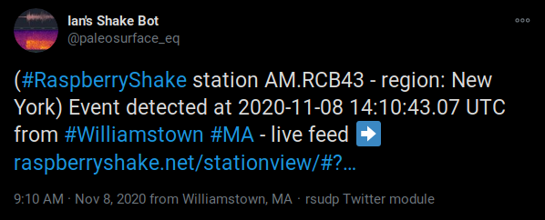

.. _settings:

Modules and Settings
#################################################

.. role:: bash(code)
    :language: bash

.. role:: json(code)
    :language: json

.. role:: pycode(code)
    :language: python

You will need to adjust the settings file before running :bash:`rsudp` in order to
both receive data and suit your earthquake detection and notification needs.
Additionally after changing settings, you will need to restart :bash:`rsudp` to load new values.

By default, the rsudp settings file will live in :bash:`$HOME/.config/rsudp/rsudp_settings.json`,
where :bash:`$HOME` is your home directory (often shortened to :bash:`~/`).
To output default settings to a different location, see :ref:`running-manually`.

:code:`settings` (general settings)
*************************************************

The :json:`"settings"` portion of the settings file contains some basic items:
:json:`"port"`, :json:`"station"`, :json:`"output_dir"`, and :json:`"debug"`.
Change :json:`"port"` if you are receiving the data at a different port than :json:`8888`.
To set your station name, change the value set for :json:`"station"`.
:json:`"output_dir"` will contain folders for miniSEED data and plot screenshots,
which are explained in the relevant sections (write and plot) below.
The directory specified here will be created if it doesn't already exist.
:json:`"debug"` controls how much text is sent to the command line STDOUT
(even if this is false, output will always be sent to a log at :code:`/tmp/rsudp/rsudp.log`).

:code:`plot` (live data plot)
*************************************************

:json:`"plot"` controls :class:`rsudp.c_plot.Plot`, the thread containing the GUI plotting algorithm.
This module can plot seismogram data from a list of 1-4 Shake channels, and calculate and display a spectrogram beneath each.

By default the plotted :json:`"duration"` in seconds is :json:`30`.
The plot will refresh at most once per second, but slower processors may take longer.
The longer the duration, the more processor power it will take to refresh the plot,
especially when the spectrogram is enabled.
To disable the spectrogram, set :json:`"spectrogram"` to :json:`false` in the settings file.
To put the plot into fullscreen window mode, set :json:`"fullscreen"` to :json:`true`.
To put the plot into kiosk mode, set :json:`"kiosk"` to :json:`true`.

.. note::

    Kiosk mode will force the plot to fill the entire screen.
    To exit, press Ctrl+W or Alt+Tab (Command+Tab on Mac OS) to bring up a window switcher).

.. note::

    On a Raspberry Pi 3B+, plotting 600 seconds of data and a spectrogram from one channel,
    the update frequency is approximately once every 5 seconds,
    but more powerful processors will be able to accommodate a higher refresh speed.

.. note::

    Because the plot module is queue-based, it will not drop any packets received, no matter the processor.
    Dropped packets (if you experience them) are most likely a sign of network issues
    where the missing data never actually arrives at the receiving machine.

By default, the :json:`"channels"` field is :json:`["HZ", "HDF"]`.
This will resolve to at least one channel of any Shake input.
:json:`"HZ"` will match either :json:`"SHZ"` or :json:`"EHZ"` depending on your Shake digitizer model,
and :json:`"HDF"` will match the pressure transducer channel on a Raspberry Boom or Shake & Boom.
If one of the channels in the list doesn't exist in the data sent to the port, it will be ignored.

The program will use the Raspberry Shake FDSN service to search for an inventory response file
for the Shake you specify in the :json:`"station"` field.
If it successfully finds an inventory,
setting "deconvolve" to :json:`true` will deconvolve the channels plotted to either :json:`"ACC"` (acceleration in m/s^2),
:json:`"VEL"` (velocity in m/s), or :json:`"DISP"` (displacement in m).
The default is :json:`"CHAN"` which lets the program deconvolve the channel
to its native units (acceleration for accelerometers, and velocity for geophones).
This means that the Shake must both have the 4.5 Hz geophone distributed by RS,
and be forwarding data to the Shake server, in order to deconvolve successfully.
For the time being, the Raspberry Boom will display in counts of Voltage, i.e., not a deconvolved unit.

If the :ref:`alert` module is enabled, setting :json:`"eq_screenshots"` to :json:`true`
will result in screenshots being saved whenever there is an :code:`ALARM`
is internally forwarded for further processing (see Alert section below).
The script will save one PNG figure per alert to the :code:`screenshots` directory
inside of :json:`"output_dir"` when the leading edge of the quake is about 70% of the way across the plot window.
This will only occur when the alarm gets triggered, however, so make sure to test your alert settings thoroughly.

`Back to top ↑ <#top>`_

.. _alert:

:code:`alert` (STA/LTA earthquake detection trigger)
*********************************************************************************

.. |license| raw:: html

   <a href="https://github.com/raspishake/rsudp/blob/master/LICENSE" target="_blank">license</a>

.. warning::

    **Standard performance disclaimer**

    It is extremely important that you do not rely on this code to save life or property.
    It is not a substitute for earthquake early warning (EEW), or state or local official
    communication and alert systems.

    Although this software can detect earthquakes and sudden motion events,
    Raspberry Shake makes no guarantee and provides no warranty in any way,
    implied or explicit, for the performance of this software in earthquake detection.

    Raspberry Shake assumes no liability for false positives, false negatives,
    errors running the Alert module, or any other part of this software;
    it is meant for hobby and non-professional notification use only.

    If you need professional-grade software to provide a warning intended to save life
    or property, please contact Raspberry Shake directly or look elsewhere.
    See sections 16 and 16b of the |license| for further details.

.. |obspy_stalta| raw:: html

   <a href="https://docs.obspy.org/tutorial/code_snippets/trigger_tutorial.html#recursive-sta-lta" target="_blank">here</a>

:json:`"alert"` controls the :class:`rsudp.c_alert.Alert` module (please see Warning above).
The alert module is a fast recursive STA/LTA sudden motion detector that utilizes obspy's
:py:func:`obspy.signal.trigger.recursive_sta_lta` function
(more detailed information on how to use that function |obspy_stalta|).
STA/LTA algorithms calculate a ratio of the short term average of station noise to the long term average.
The data can be highpass, lowpass, or bandpass filtered by changing the :json:`"highpass"`
and :json:`"lowpass"` parameters from their defaults (:json:`0` and :json:`50` respectively).
By default, the alert will be calculated on raw count data
from the vertical geophone channel (either :json:`"SHZ"` or :json:`"EHZ"`).
It will throw an error if there is no Z channel available (i.e. if you have a Raspberry Boom with no geophone).
If you have a Boom and still would like to run this module, change the default channel :json:`"HZ"` to :json:`"HDF"`.

Like in the plot module, the alert module deconvolves the instrument response if a response file exists
for your :json:`"station"` on the Raspberry Shake FDSN server.
Same as above, if the response file exists,
setting :json:`"deconvolve"` to :json:`true` will cause the alert function to
calculate the STA/LTA ratio on deconvolved data (again :json:`"ACC"`, :json:`"VEL"`, or :json:`"DISP"`).

If the STA/LTA ratio goes above a certain value (defined by :json:`"threshold"`),
then the :py:class:`rsudp.p_producer.Producer` thread will generate an :code:`ALARM` "event packet",
to be distributed to every consumer module.
This tells all consumers listening for :code:`ALARM` messages to do something.

When the ratio goes back below the :json:`"reset"` value, the alarm is reset.
The Producer will then send a :code:`RESET` message to the queues.

For more information on the packets generated by the Producer, see :ref:`producer-consumer`.

Recommendations
^^^^^^^^^^^^^^^^^^^^^^^^^^^^^^^^^^

The detection and filtering settings that we've found work well are below for different scenarios.

General use
"""""""""""""""""""""""""""""""""""

For a station with sudden motion (footsteps nearby occasionally),
or one atop unconsolidated sediment:

.. code-block::

    "alert": {
        "enabled": true,
        "channel": "HZ",
        "sta": 6,
        "lta": 30,
        "threshold": 4.5,
        "reset": 0.5,
        "highpass": 0.8,
        "lowpass": 9,
        "deconvolve": false,
        "units": "VEL"},

Quiet vault
"""""""""""""""""""""""""""""""""""

For a very quiet station placed atop bedrock:

.. code-block::

    "alert": {
        "enabled": true,
        "channel": "HZ",
        "sta": 6,
        "lta": 30,
        "threshold": 1,
        "reset": 0.2,
        "highpass": 0.8,
        "lowpass": 9,
        "deconvolve": false,
        "units": "VEL"},

Classroom demonstrations
"""""""""""""""""""""""""""""""""""

For a classroom looking to detect jumps but not necessarily earthquakes is below.
The main difference here is that there is no bandpass filter applied to the signal
before it is put into the STA/LTA algorithm, which changes the calculation needed
for exceedence of the threshold. Adjust the :json:`"threshold"` downward, closer to 
:json:`1.7` if :json:`1.8` is too high.

.. code-block::

    "alert": {
        "enabled": true,
        "channel": "HZ",
        "sta": 6,
        "lta": 30,
        "threshold": 1.8,
        "reset": 1.6,
        "highpass": 0,
        "lowpass": 50,
        "deconvolve": false,
        "units": "VEL"},

Using :code:`"exec"`
^^^^^^^^^^^^^^^^^^^^^^^^^^^^^^^^^^

    .. deprecated:: 0.4.3

        You can change the :json:`"exec"` field and supply a path to
        executable Python code to run with the :py:func:`exec` function.
        :py:func:`exec` functionality will move to its own module in version 0.4.3
        (see :ref:`customcode` and the :py:class:`rsudp.c_custom.Custom` class),
        and this part of the alert module will be fully removed in a future release.

`Back to top ↑ <#top>`_

:code:`RSAM` (Real-time Seismic AMplitude)
*************************************************

.. versionadded:: 1.0.1

This module calculates the Real-time Seismic Amplitude Measurement (RSAM) of the data stream every few seconds
and can forward this data to another location on the network.

:json:`"interval"` is a float that specifies the number of seconds to wait between each RSAM analysis.

:json:`"quiet"` controls the amount of data printed to the console in debug mode.
When :json:`"quiet"` is :json:`true`, the module will not print any RSAM analysis,
If debug mode is on and :json:`"quiet"` is :json:`false`, then the module will
print the analysis to the console every :json:`"interval"` seconds.

:json:`"fwaddr"` and :json:`"fwport"` specify the forwarding address and port to which to
optionally send RSAM data. If one of these fields is :json:`false` then no data will be
forwarded. If these fields are populated with valid IP and port, data will be forwarded every
:json:`"interval"` seconds.

:json:`"fwformat"` specifies the format of data to be forwarded. There are three formats,
:json:`"LITE"`, :json:`"JSON"`, and :json:`"CSV"`, which can be used depending on the
endpoint processing method and size constraints.

:json:`"channel"` specifies the channel to use for RSAM analysis (only one can be chosen).

:json:`"deconvolve"` specifies whether the instrument response should be removed from the data stream
prior to RSAM calculations.

To run the RSAM module, set :json:`"enabled"` to :json:`true`.

:code:`alarmsound` (play sounds upon alerts)
*************************************************

.. |pydub_deps| raw:: html

   <a href="https://github.com/jiaaro/pydub#dependencies" target="_blank">this page</a>

If alarmsound's :json:`"enabled"` is :json:`true` and you have either :bash:`ffmpeg` or :bash:`libav` installed,
:class:`rsudp.c_alertsound.AlertSound` plays an MP3 sound every time it receives an :code:`ALARM` queue message.
For details on installation of these dependencies, see |pydub_deps|.

The rsudp software will install several small MP3 files.
The :json:`"mp3file"` is :json:`"doorbell"` (two doorbell chimes) by default,
but there are a few more aggressive alert sounds, including: a three-beep sound :json:`"beeps"`,
a sequence of sonar pings :json:`"sonar"`,
and a continuous alarm beeping for 5 seconds, :json:`"alarm"`.
You can also point the :json:`"mp3file"` field to an MP3 file somewhere in your filesystem.
For example, if your username was :code:`pi` and you had a file called `earthquake.mp3` in your Downloads folder,
you would specify :json:`"mp3file": "/home/pi/Downloads/earthquake.mp3"`.
The program will throw an error if it can't find (or load) the specified MP3 file.
It will also alert you if the software dependencies for playback are not installed.

To test the sound output, ensure you have the correct dependencies installed (see below),
change :json:`"enabled"` to :json:`true`, start rsudp,
wait for the trigger to warm up, then stomp, jump, or Shake to trigger the sound.

Installing :code:`pydub` dependencies
^^^^^^^^^^^^^^^^^^^^^^^^^^^^^^^^^^^^^^^^^^^

If you would like to play sounds when the STA/LTA trigger activates,
you will need to take the following installation steps beforehand:

On Linux
"""""""""""""""""""""""""""""""""""""""""""""""""""""

.. |ffmpeg| raw:: html

   <a href="http://ffmpeg.org/" target="_blank">ffmpeg</a>

.. |ffmpeg_dl| raw:: html

   <a href="http://ffmpeg.org/download.html#build-mac" target="_blank">from the ffmpeg website</a>

|ffmpeg| comes installed by default on some OS flavors
and is available on most Linux package managers.

Debian and Raspbian users can simply type :bash:`sudo apt update; sudo apt install ffmpeg`

On MacOS
"""""""""""""""""""""""""""""""""""""""""""""""""""""

Users with Homebrew can install by doing :bash:`brew install ffmpeg`

Users without Homebrew will need to install using a binary build |ffmpeg_dl|.

On Windows
"""""""""""""""""""""""""""""""""""""""""""""""""""""

.. |ffmpeg_win| raw:: html

   <a href="https://windowsloop.com/install-ffmpeg-windows-10/" target="_blank">this installation guide</a>

Windows users will need to do a couple of extra steps to get :code:`ffmpeg` installed.
Following steps 1-8 in |ffmpeg_win| should be sufficient to get things working.

`Back to top ↑ <#top>`_

:code:`telegram` (Telegram notification module)
*************************************************

.. |telegram| raw:: html

    <a href="https://t.me/" target="_blank">Telegram</a>

.. |sasmex| raw:: html

    <a href="https://sasmex.net/" target="_blank">SASMEX</a>

.. |sasmex_telegram| raw:: html

    <a href="https://t.me/sasmex" target="_blank">Telegram channel here</a>

|telegram| is a free and open source messaging and notification system,
used by several earthquake notification agencies including the
Mexican national early warning system (|sasmex|, |sasmex_telegram|).
It has the bonus of being much, much easier to set up than Twitter,
and will not as readily lock your account if there happen to be many posts in a short time period
(in comparison to Twitter).

If :json:`"enabled"` is :json:`true`, and bot :json:`"token"` key is correctly entered,
:class:`rsudp.c_telegram.Telegrammer` will use the Telegram bot API to create alerts when an
:code:`ALARM` message arrives on the queue.
If :json:`"send_images"` is :json:`true`, then the module will also send a saved image of the event,
if :json:`"eq_screenshots"` is set to :json:`true` in the :json:`"plot"` module.

If any text is put in the :json:`"extra_text"` string, then the software will insert that text
(no longer than 3900 characters) into the message after the UTC designation and prior to the
stationview hyperlink.
This works similarly to the :json:`"extra_text"` field in the Twitter module below.
(See :ref:`examples`.)

.. warning::

    Starting the software with an :json:`"extra_text"` string in excess of 3900 characters
    will yield a warning and the :json:`"extra_text"` string will be truncated
    in order to avoid the message being rejected for exceeding the 4096 character limit.

.. _setting-up-telegram:

Setting up a Telegram Bot
^^^^^^^^^^^^^^^^^^^^^^^^^^^^^^^^^^^^^^^^^^^^^^^^^^^

Here is a brief overview of the steps to set up a Telegram bot in order to make and distribute
Telegram alerts from rsudp.

.. |so_answer| raw:: html

    <a href="https://stackoverflow.com/a/32572159" target="_blank">this stackoverflow answer</a>

#. Download |telegram|, create a profile, and sign in.
#. Create a Telegram bot by sending the :code:`/start` message to the :code:`@BotFather` account.
#. Follow the instructions. Your messages to :code:`@BotFather` should look something like the following:

    #. :code:`/start`

    #. :code:`/newbot`

    #. :code:`Your Shake Bot Name`

    #. :code:`your_shake_bot_id`

    #. :code:`@BotFather` will then give you an access token for your new bot.

#. Enter your bot's access token in the :json:`"token"` field of the settings file.
#. Enter a user or group ID into the :json:`"chat_id"` field (or multiple separated by commas),
    which you can find by following the instructions in |so_answer|.

If you wish to broadcast telegrams to a group or a channel, first add the bot to the group using your
user account, then follow the instructions in the previous link,
where you will see the group chat ID appear as a field in the last JSON entry.
This chat ID may be negative, in which case you must enter the negative sign into :json:`"chat_id"`
as well.

`Back to top ↑ <#top>`_

:code:`tweets` (Twitter notification module)
*************************************************

If :json:`"enabled"` is :json:`true`, and all API keys have been generated and are correctly entered,
then the :class:`rsudp.c_tweet.Tweeter` class will use the Twitter API to
create tweets when an ALARM message arrives on the queue.
If :json:`"tweet_images"` is :json:`true`, then the module will also tweet a saved image of the event,
if :json:`"eq_screenshots"` is set to :json:`true` in the "plot" module. If any text is put in the
:json:`"extra_text"` string, then the software will insert that text (no longer than 103 characters)
into the tweets after a single space. See examples below.

.. _eq-tweet-examples:

Examples
^^^^^^^^^^^^^^^^^^^^^^^^^^^^^^^^^^^^^^^^^^^^^^^^^^^

As a comparison point, an unmodified tweet with :code:`"extra_text": ""` might look like
the following:

.. _eq-tweet:
.. figure::  _static/eq_tweet.png
    :align:   center

    An example tweet sent with the "extra_text" parameter empty (this is the default).

Changing the :json:`"extra_text"` parameter to :code:`"extra_text": "from #Williamstown #MA"`
would render something like this:

.. _eq-tweet-extra:

    An example tweet sent with the "extra_text" parameter filled.

.. warning::

    Starting the software with an :json:`"extra_text"` string in excess of 103 characters
    will yield a warning and the :json:`"extra_text"` string will be truncated
    in order to avoid the tweet being rejected for exceeding the 280 character limit.

.. _setting-up-twitter:

Setting up Twitter Apps
^^^^^^^^^^^^^^^^^^^^^^^^^^^^^^^^^^^^^^^^^^^^^^^^^^^

Here is a brief overview of the steps to set up a Twitter app (also known as an API bot)
in order to make and distribute tweets from rsudp.

.. |tw_signup| raw:: html

    <a href="https://twitter.com/signup" target="_blank">Create a twitter profile</a>

.. |tw_dev| raw:: html

    <a href="https://developer.twitter.com/en.html" target="_blank">Twitter developer account</a>

.. |tw_api_app| raw:: html

    <a href="https://opensource.com/article/17/8/raspberry-pi-twitter-bot" target="_blank">Twitter API app</a>

#. |tw_signup| (or use an existing account).
#. Register this account as a |tw_dev|.
#. Create a |tw_api_app| inside said developer account.
#. Generate consumer keys and API keys for that app.

Once you have generated the four API keys required for authentication
(consumer API key, consumer API secret, access token, and access token secret),
you may enter them into your settings file in the appropriate fields:
:json:`"api_key"`, :json:`"api_secret"`, :json:`"access_token"`, and :json:`"access_secret"`.

`Back to top ↑ <#top>`_

:code:`write` (miniSEED writer)
*************************************************

:json:`"write"` controls :class:`rsudp.c_write.Write`, a very simple STEIM2 miniSEED writer class.
If :json:`"enabled"` is :json:`true`, seismic data is appended to a miniSEED file with a
descriptive name in the data directory inside of :json:`"output_dir"` every 10 seconds.
By default, :json:`"all"` channels will be written to their own files.
You can change which channels are written by changing this to, for example, :json:`["EHZ", "ENZ"]`,
which will write the vertical geophone and accelerometer channels from RS4D output.

`Back to top ↑ <#top>`_

.. _datacast-forwarding:

:code:`forward` (datacast forwarding)
*************************************************

The :json:`"forward"` module controls :class:`rsudp.c_forward.Forward`, a UDP datacast forwarding module.
You can forward UDP packets containing data and/or alarm state messages to a list of destinations specified
in :json:`"address"` and :json:`"port"`, just like you would from the Shake's web front end.

By default, :json:`["all"]` channels are forwarded. To forward only data from EHZ and ENZ
channels, set this field to a list, e.g. :json:`["EHZ", "ENZ"]`.

To change the types of messages that are forwarded, change the boolean fields :json:`"fwd_data"` and
:json:`"fwd_alarms"` accordingly. Setting :code:`"fwd_data": true` will forward data from the specified
channels, while :code:`"fwd_alarms": true` will forward :code:`ALARM` and :code:`RESET` messages. These can
both be set to true simultaneously.

To take advantage of this forwarding capability in another piece of software (such as NodeRED), it may help
to consult the :ref:`message-types`.

Forwarding to multiple destinations (such as in a classroom setting) is easy. Say you want to send alarm
messages to several Raspberry Pis running NodeRED in a classroom. Simply create equal-length lists of
addresses and ports in the forward settings like so::

    "forward": {
        "enabled": false,
        "address": ["192.168.1.250","192.168.1.251","192.168.1.252","192.168.1.253"],
        "port": [8888,8888,8888,8888],
        "channels": ["all"],
        "fwd_data": false,
        "fwd_alarms": true},

This will create one Forward thread per destination and distribute :code:`ALARM` and :code:`RESET`
messages to each simultaneously. Each Pi node can then be configured to listen to its own port 8888
(127.0.0.1:8888) to read these messages.

`Back to top ↑ <#top>`_

.. _customcode:

:code:`custom` (run custom code)
*************************************************

.. versionadded:: 0.4.3

.. warning:: Do not use this module unless you understand the implications of running unchecked code.

:json:`"custom"` controls the execution of a custom python code file specified by the :json:`"codefile"` field.
If :json:`"enabled"` is :json:`true` and a python file is found at the path specified,
this thread will run the specified file using python's :py:func:`exec` function.

Be very careful when using this module, as the :py:func:`exec` function is known to have problems.
Notably, :py:func:`exec` does not check the passed file for errors prior to running.
Also, the passed file cannot have Windows line endings (see warning below).
Additionally, if the code takes too long to execute,
you could end up losing data packets from the queue, so keep it simple.
Sending a message or a tweet, which should either succeed or time out in a few seconds,
is really the intended purpose, and this can typically be achieved by setting up a different module anyway
(see Twitter and Telegram modules).

In testing, we were able to run scripts with execution times of 30 seconds without losing any data packets.
Theoretically you could run code that takes longer to process than that,
but the issue is that the longer it takes the function to process code,
the longer the module will go without processing data from the queue
(the queue can hold up to 2048 packets, which for a RS4D works out to ~128 seconds of data).
Another way of saying this is: you could miss whatever subsequent earthquakes occur while :pycode:`exec()` is running.
A better way to run your own code would be to fork this repository
and create a new thread that does the thing you want when it sees an ALARM data packet on the queue.
That way, the code will be checked for errors prior to running.

.. |lineendings_howto| raw:: html

   <a href="https://stackoverflow.com/questions/17579553/windows-command-to-convert-unix-line-endings" target="_blank">this stackoverflow question</a>

.. |lineendings_wiki| raw:: html

   <a href="https://en.wikipedia.org/wiki/Newline" target="_blank">here</a>

.. warning::

    If you are running Windows and have code you want to pass to the :py:func:`exec` function,
    Python requires that your newline characters are in the UNIX style (:code:`\n`), not the standard Windows style (:code:`\r\n`).
    To convert, follow the instructions in one of the answers to |lineendings_howto|.
    If you're not sure what this means, please read about newline/line ending characters |lineendings_wiki|.
    If you are certain that your code file has no Windows newlines, you can set :json:`"win_override"` to :json:`true`.

    Code will not execute on Windows unless this field is set to :json:`true`.

`Back to top ↑ <#top>`_

:code:`printdata` (print data to console)
*************************************************

:json:`"printdata"` controls the data output module :class:`rsudp.c_printraw.PrintRaw`,
which simply prints Shake data packets to stdout as it receives them.
Change :json:`"enabled"` to :json:`true` to activate.

`Back to top ↑ <#top>`_

You are now ready to proceed to the next section, :ref:`running`.

.. _defaults:

Default settings
*************************************************

By default, the settings are as follows:

.. code-block:: json

    {
    "settings": {
        "port": 8888,
        "station": "Z0000",
        "output_dir": "@@DIR@@",
        "debug": true},
    "printdata": {
        "enabled": false},
    "write": {
        "enabled": false,
        "channels": ["all"]},
    "plot": {
        "enabled": true,
        "duration": 30,
        "spectrogram": true,
        "fullscreen": false,
        "kiosk": false,
        "eq_screenshots": false,
        "channels": ["HZ", "HDF"],
        "deconvolve": true,
        "units": "CHAN"},
    "forward": {
        "enabled": false,
        "address": ["192.168.1.254"],
        "port": [8888],
        "channels": ["all"],
        "fwd_data": true,
        "fwd_alarms": false},
    "alert": {
        "enabled": true,
        "channel": "HZ",
        "sta": 6,
        "lta": 30,
        "threshold": 1.7,
        "reset": 1.6,
        "highpass": 0,
        "lowpass": 50,
        "deconvolve": false,
        "units": "VEL"},
    "alertsound": {
        "enabled": false,
        "mp3file": "doorbell"},
    "custom": {
        "enabled": false,
        "codefile": "n/a",
        "win_override": false},
    "tweets": {
        "enabled": false,
        "tweet_images": true,
        "api_key": "n/a",
        "api_secret": "n/a",
        "access_token": "n/a",
        "access_secret": "n/a",
        "extra_text": ""},
    "telegram": {
        "enabled": false,
        "send_images": true,
        "token": "n/a",
        "chat_id": "n/a",
        "extra_text": ""},
    "rsam": {
        "enabled": false,
        "quiet": true,
        "fwaddr": "192.168.1.254",
        "fwport": 8887,
        "fwformat": "LITE",
        "channel": "HZ",
        "interval": 10,
        "deconvolve": false,
        "units": "VEL"}
    }

................

* :ref:`genindex`
* :ref:`search`

.. * :ref:`modindex`

`Back to top ↑ <#top>`_
